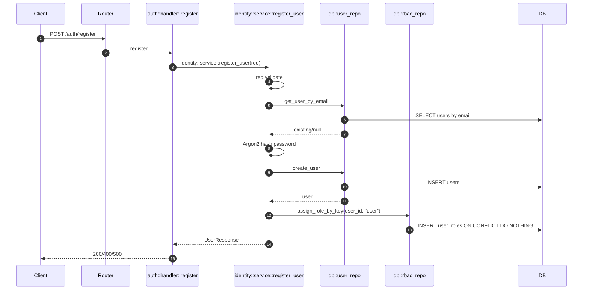
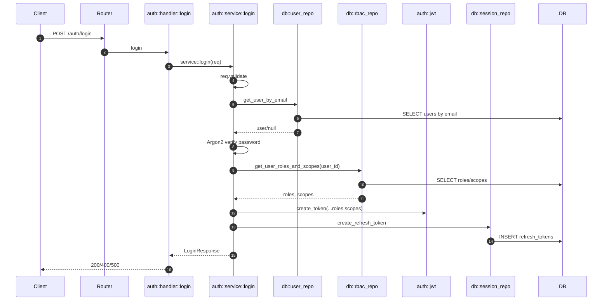
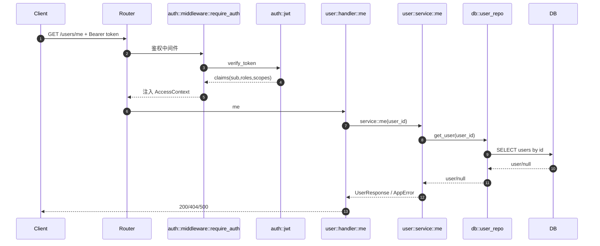
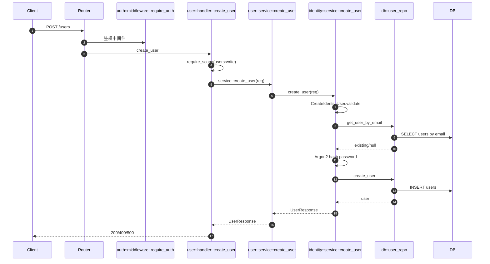
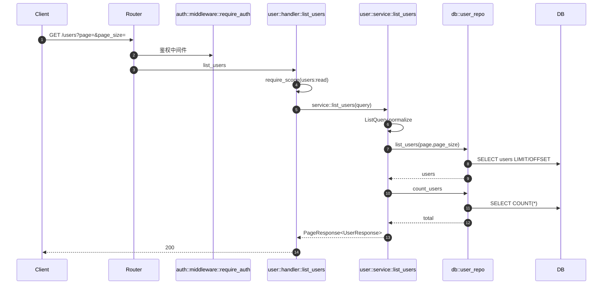
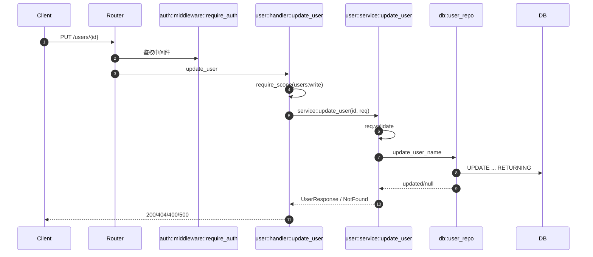
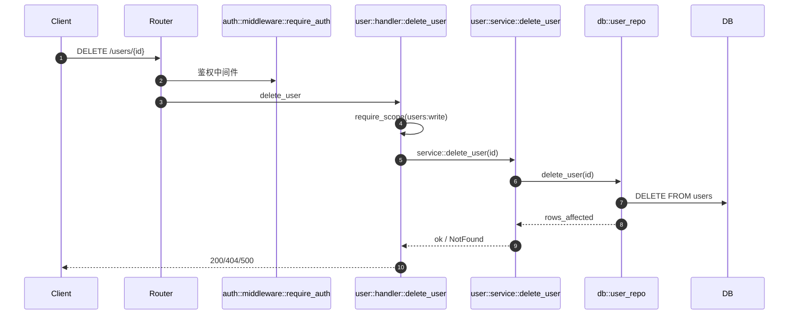
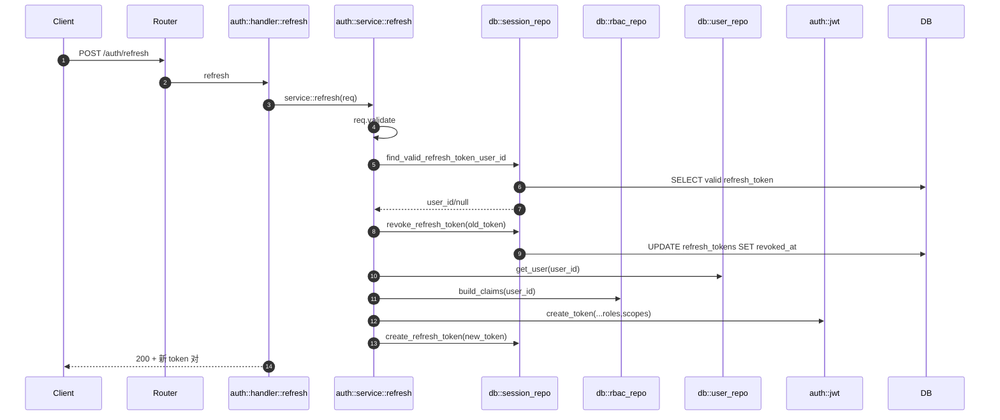
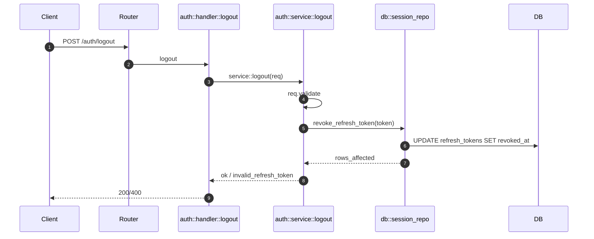

# rust-platform-template

一个面向 Web 开发、可长期复用的 Rust 后端 workspace 模板。当前包含一个完整示例服务 `apps/blog-api`，并已实现统一错误码、结构化校验错误、认证中间件、RBAC 持久化与动态 claims、refresh token 流程。

当前 `blog-api` 的认证相关能力已按 `identity / auth / rbac / user` 分层：
- `identity`：注册、密码哈希、凭证校验、用户创建
- `auth`：`login / refresh / logout`、JWT、session/refresh token
- `rbac`：授权上下文、权限判断、角色/权限常量与矩阵
- `user`：用户资源接口，不再承载认证逻辑

## 1. 项目结构

```text
rust-platform-template/
├── crates/
│   ├── app-foundation/   # 通用基础能力（配置/错误/响应/中间件/i18n/查询参数）
│   └── app-testkit/      # 测试辅助工具
├── apps/
│   └── blog-api/         # 示例业务服务
├── docker-compose.yml    # 本地 PostgreSQL
├── Cargo.toml            # workspace 配置
└── README.md
```

## 2. 当前实现能力（按模块）

### 2.1 `crates/app-foundation`

- 基础配置：`BaseConfig`（`APP_HOST`、`APP_PORT`、`DEFAULT_LOCALE`）
- 统一错误模型：`AppError`
  - HTTP 状态码映射（400/403/404/500）
  - 稳定业务错误码：`error_code`
  - 可选结构化校验详情：`details[{field, reason}]`
- 错误码枚举：`ErrorCode`（如 `AUTH_INVALID_TOKEN`、`USER_EMAIL_EXISTS`）
- 统一响应：`ApiResponse<T>`、`PageResponse<T>`
- 通用列表查询参数：`ListQuery`（`page/page_size/sort/order/filter`）
- 请求追踪中间件：自动注入/透传 `x-request-id`
- 基础国际化：`zh-CN` / `en-US`
- 健康检查：`web::health`

### 2.2 `crates/app-testkit`

- `get_text`：对 Axum Router 发起测试请求并读取响应文本
- `request_json`：发送 JSON 请求并解析 JSON 响应
- `request_json_with_auth`：发送带 Bearer Token 的 JSON 请求
- `request_empty_json_with_auth`：发送空 JSON 请求并附带 Bearer Token

### 2.3 `apps/blog-api`

- 身份域：用户注册、用户创建、密码哈希与凭证校验
- 认证域：登录、refresh token 轮换、登出撤销、JWT 签发与校验
- 认证会话管理：列出当前用户会话、撤销单个会话、撤销全部会话
- 授权域：`AccessContext`、RBAC 持久化、动态 claims、角色/权限矩阵
- RBAC 管理：管理员查询角色/权限、查询用户访问上下文、分配/撤销用户角色
- Refresh Token 轮换与登出撤销
- 用户 CRUD 与分页查询
- 用户列表支持分页、白名单排序和按 `name` / `email` 模糊过滤
- 认证中间件注入 `rbac::context::AccessContext`
- RBAC 持久化：`roles` / `permissions` / `user_roles` / `role_permissions`
- 授权能力：`require_role` / `require_scope`
- `/users`、`/users/{id}`、`/users/me` 已接入认证与 RBAC 校验：
  - 读操作要求 `users:read`
  - 写操作要求 `users:write`
- 外部 HTTP 调用示例：`/external/ip`
- 启动时自动 migration（可通过开发开关跳过）
- JWT 配置已收口到 `AppConfig.auth`
- 角色/权限常量与矩阵位于：
  - `apps/blog-api/src/modules/rbac/keys.rs`
  - `apps/blog-api/src/modules/rbac/catalog.rs`
- 认证/RBAC 重构说明见：
  - `apps/blog-api/docs/auth-rbac-refactor.md`

## 3. API 列表

- `GET /health`
- `POST /auth/register`
- `POST /auth/login`
- `POST /auth/refresh`
- `POST /auth/logout`
- `GET /auth/sessions`（需要 Bearer Token）
- `DELETE /auth/sessions/{id}`（需要 Bearer Token）
- `POST /auth/sessions/revoke-all`（需要 Bearer Token）
- `GET /users/me`（需要 Bearer Token）
- `POST /users`（需要 Bearer Token + `users:write`）
- `GET /users?page=1&page_size=10&sort=...&order=...&filter=...`（需要 Bearer Token + `users:read`）
- `GET /users/{id}`（需要 Bearer Token + `users:read`）
- `PUT /users/{id}`（需要 Bearer Token + `users:write`）
- `DELETE /users/{id}`（需要 Bearer Token + `users:write`）
- `GET /rbac/roles`（需要 Bearer Token + `admin`）
- `GET /rbac/permissions`（需要 Bearer Token + `admin`）
- `GET /rbac/users/{id}`（需要 Bearer Token + `admin`）
- `POST /rbac/users/{id}/roles`（需要 Bearer Token + `admin`）
- `DELETE /rbac/users/{id}/roles`（需要 Bearer Token + `admin`）
- `GET /external/ip`

## 3.1 测试辅助入口

- 通用 HTTP 测试辅助：`crates/app-testkit/src/lib.rs`
- blog-api 专属测试辅助：`apps/blog-api/tests/support/mod.rs`

目前已沉淀的辅助包括：
- app/db 初始化
- 注册并登录获取测试会话
- refresh 获取新测试会话
- 提升测试用户为管理员
- 强制测试会话过期
- 测试用户清理

## 4. 接口时序图

### 4.1 `POST /auth/register`



### 4.2 `POST /auth/login`



### 4.3 `GET /users/me`（需要 Bearer）



### 4.4 `POST /users`



### 4.5 `GET /users`



### 4.6 `PUT /users/{id}`



### 4.7 `DELETE /users/{id}`



### 4.8 `POST /auth/refresh`



### 4.9 `POST /auth/logout`



## 5. 统一响应约定

成功响应：

```json
{
  "code": 0,
  "message": "ok",
  "data": {}
}
```

错误响应（示例）：

```json
{
  "code": 400,
  "error_code": "USER_EMAIL_EMPTY",
  "message": "email cannot be empty",
  "details": [
    { "field": "email", "reason": "required" }
  ]
}
```

说明：

- `message` 受 `DEFAULT_LOCALE` 影响（中文/英文）
- `error_code` 是稳定机器码，供前端/调用方做逻辑判断
- `details` 仅在校验类错误时出现

## 6. 认证与授权现状

- Access Token：JWT（`sub/iat/exp/roles/scopes`）
- Claims 动态生成：登录/刷新时从 RBAC 表实时查询 `roles/scopes` 并签发
- Refresh Token：数据库持久化，`/auth/refresh` 会执行轮换（旧 token 撤销，新 token 下发）
- Logout：`/auth/logout` 撤销指定 refresh token
- 认证：`auth::middleware::require_auth` 统一解析 Bearer 并注入 `rbac::context::AccessContext`
- 授权：`auth::authorization::{require_role, require_scope}`，当前示例在 `/users/me` 使用 `require_scope("users:read")`
- 注册默认角色：新用户注册后自动绑定 `user` 角色；历史用户登录时会自动补齐默认角色

## 7. 数据库结构

### 7.1 `users`

- `id UUID PRIMARY KEY`
- `name TEXT NOT NULL`
- `email TEXT NOT NULL UNIQUE`
- `password_hash TEXT NOT NULL`
- `created_at TIMESTAMPTZ NOT NULL`
- `updated_at TIMESTAMPTZ NOT NULL`

### 7.2 `refresh_tokens`

- `id UUID PRIMARY KEY`
- `user_id UUID NOT NULL REFERENCES users(id) ON DELETE CASCADE`
- `refresh_token TEXT NOT NULL UNIQUE`
- `expires_at TIMESTAMPTZ NOT NULL`
- `created_at TIMESTAMPTZ NOT NULL`
- `revoked_at TIMESTAMPTZ NULL`
- 索引：`user_id`、`expires_at`

### 7.3 `roles`

- `id BIGSERIAL PRIMARY KEY`
- `role_key TEXT NOT NULL UNIQUE`（如 `user`、`admin`）
- `description TEXT NOT NULL`
- `created_at TIMESTAMPTZ NOT NULL`

### 7.4 `permissions`

- `id BIGSERIAL PRIMARY KEY`
- `permission_key TEXT NOT NULL UNIQUE`（如 `users:read`、`*`）
- `description TEXT NOT NULL`
- `created_at TIMESTAMPTZ NOT NULL`

### 7.5 `role_permissions`

- `role_id BIGINT NOT NULL REFERENCES roles(id) ON DELETE CASCADE`
- `permission_id BIGINT NOT NULL REFERENCES permissions(id) ON DELETE CASCADE`
- `created_at TIMESTAMPTZ NOT NULL`
- 主键：`(role_id, permission_id)`

### 7.6 `user_roles`

- `user_id UUID NOT NULL REFERENCES users(id) ON DELETE CASCADE`
- `role_id BIGINT NOT NULL REFERENCES roles(id) ON DELETE CASCADE`
- `created_at TIMESTAMPTZ NOT NULL`
- 主键：`(user_id, role_id)`

## 8. 国际化

当前支持：

- `zh-CN`
- `en-US`

当前行为：

- 语言由 `DEFAULT_LOCALE` 决定（全局）
- 尚未实现按请求头（`Accept-Language`）动态切换

## 9. 快速开始

### 9.1 启动数据库

```bash
docker compose up -d
```

### 9.2 准备环境变量

仓库根目录：

```bash
cp .env.example .env
```

或服务目录：

```bash
cd apps/blog-api
cp .env.example .env
```

### 9.3 启动服务

```bash
cargo run -p blog-api
```

开发模式可跳过 migration：

```bash
SKIP_MIGRATIONS=true cargo run -p blog-api
```

> 注意：`SKIP_MIGRATIONS=true` 只跳过迁移，不跳过数据库连接。

### 9.4 检查与测试

```bash
cargo check --workspace
cargo fmt --all
cargo clippy --workspace --all-targets --all-features -- -D warnings
cargo test --workspace
```

## 10. Makefile

- `make up`
- `make down`
- `make check`
- `make fmt`
- `make clippy`
- `make test`
- `make run-blog-api`

## 11. 环境变量

- `APP_HOST`
- `APP_PORT`
- `RUST_LOG`
- `DEFAULT_LOCALE`
- `DATABASE_URL`
- `HTTPBIN_BASE_URL`
- `JWT_SECRET`
- `JWT_EXPIRE_SECONDS`
- `JWT_REFRESH_EXPIRE_SECONDS`
- `SKIP_MIGRATIONS`

## 12. 当前验证状态

本仓库当前可通过：

- `cargo fmt --all`
- `cargo check --workspace`
- `cargo test --workspace`

## 13. 后续建议

- Refresh token 明文改哈希存储，增加设备维度会话管理
- OpenAPI 自动生成与 contract tests
- 可观测性增强（metrics + tracing + 慢查询监控）
